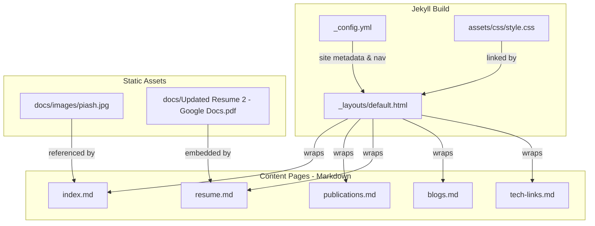

# Design Document: Website Redesign

## Overview

This design transforms Sadat Shahriar's academic website from a collection of inconsistently styled HTML pages into a unified, Markdown-driven Jekyll site. The architecture centers on a single shared layout template (`_layouts/default.html`) that provides all HTML structure, CSS styling, and navigation. Individual pages are authored as plain Markdown files with YAML front matter, making the site easy to maintain without HTML knowledge.

The visual design draws inspiration from clean academic sites like jl3676.github.io — serif typography, generous whitespace, a single-column layout, and a restrained color palette. The site retains a multi-page structure (landing, publications, resume, blogs, tech links) but with a cohesive look across all pages.

## Architecture



### Build Flow

1. Author writes/edits a `.md` file with front matter (`layout: default`, `title: ...`)
2. Jekyll reads `_config.yml` for site-wide settings (title, nav items)
3. Jekyll renders each `.md` file through `_layouts/default.html`
4. The layout injects the page content into the HTML structure, applies CSS, and renders the navigation bar
5. GitHub Pages serves the resulting static HTML

### Key Design Decisions

- **Single layout template**: All pages share one layout to guarantee visual consistency (Requirement 2).
- **External CSS file** (`assets/css/style.css`): Keeps styling separate from the layout HTML for maintainability. The layout links to this file.
- **Navigation driven by `_config.yml`**: Nav items are defined in the config as a YAML list, iterated by the layout template using Liquid. Adding/removing pages requires only a config edit.
- **`.nojekyll` removal**: The existing `.nojekyll` file must be deleted so GitHub Pages processes the site through Jekyll (Requirement 8.1).
- **No Jekyll theme gem**: Custom layout and CSS are used directly rather than a theme gem, giving full control over the minimal design.

## Components and Interfaces

### 1. Layout Template (`_layouts/default.html`)

The single shared layout that wraps all content pages.

**Responsibilities:**
- Render the HTML document skeleton (`<html>`, `<head>`, `<body>`)
- Link to `assets/css/style.css`
- Render the site header with the site title (linked to home)
- Render the Navigation_Bar by iterating over `site.data` or `site.nav` from `_config.yml`
- Highlight the active nav item by comparing `page.url` to each nav item's URL
- Inject page content via `{{ content }}`
- Render a minimal footer

**Liquid Template Interface:**
- Inputs: `site.title`, `site.nav` (array of `{title, url}`), `page.title`, `page.url`, `{{ content }}`
- Output: Complete HTML page

```html
<!-- Pseudocode structure -->
<!DOCTYPE html>
<html lang="en">
<head>
  <meta charset="UTF-8">
  <meta name="viewport" content="width=device-width, initial-scale=1.0">
  <title>{{ page.title }} | {{ site.title }}</title>
  <link rel="stylesheet" href="/assets/css/style.css">
</head>
<body>
  <div class="site-container">
    <header class="site-header">
      <a href="/" class="site-title">{{ site.title }}</a>
      <nav>
        
          <a href="{{ item.url }}" class="active">
            {{ item.title }}
          </a>
        
      </nav>
    </header>
    <main class="site-content">
      {{ content }}
    </main>
    <footer class="site-footer">
      © {{ site.time | date: '%Y' }} {{ site.title }}
    </footer>
  </div>
</body>
</html>
```

### 2. Stylesheet (`assets/css/style.css`)

**Responsibilities:**
- Define the visual design: typography, colors, spacing, layout
- Handle responsive behavior for mobile viewports (≤768px)
- Style navigation, active state, content areas, and page-specific elements (profile section, update items, publication list, embedded PDF)

**Design Tokens:**
- Font family: `'Georgia', 'Times New Roman', serif`
- Background: `#fafafa`
- Text color: `#333`
- Accent/link color: `#2c5f8a` (muted blue)
- Max content width: `750px`
- Nav active indicator: bottom border or font-weight change

### 3. Configuration (`_config.yml`)

**Responsibilities:**
- Define `title` (site-wide name)
- Define `nav` array with page titles and URLs
- Set `markdown: kramdown` (GitHub Pages default)

**Updated nav structure:**
```yaml
title: Sadat Shahriar
nav:
  - title: About
    url: /
  - title: Publications
    url: /publications
  - title: Resume
    url: /resume
  - title: Blogs & Tutorials
    url: /blogs
  - title: Tech Links
    url: /tech-links
```

### 4. Content Pages (Markdown Files)

Each page is a `.md` file with front matter and Markdown body.

#### 4a. `index.md` — Landing Page
- Front matter: `layout: default`, `title: About`
- Contains profile photo (using Markdown image or a small HTML snippet for styling), name, tagline, contact links, and the Updates_List
- Updates are written as a simple Markdown list with bold dates

#### 4b. `publications.md` — Publications
- Front matter: `layout: default`, `title: Publications`
- Numbered list of all 11 publications with author name bolded
- Links rendered inline where applicable

#### 4c. `resume.md` — CV/Resume
- Front matter: `layout: default`, `title: Resume`
- Contains a small HTML block to embed the PDF via `<embed>` tag (Markdown alone cannot embed PDFs)
- Also includes a direct download link

#### 4d. `blogs.md` — Blogs & Tutorials
- Front matter: `layout: default`, `title: Blogs & Tutorials`
- Simple list of tutorial entries with links and descriptions

#### 4e. `tech-links.md` — Tech Links
- Front matter: `layout: default`, `title: Tech Links`
- Each entry: link title, URL, and 1-2 sentence description

## Data Models

This is a static site with no database. The "data" is:

### Site Configuration (`_config.yml`)
```yaml
title: string          # Site-wide title
nav:                   # Navigation items
  - title: string      # Display text
    url: string        # Path to page
```

### Page Front Matter (per `.md` file)
```yaml
layout: string         # Always "default"
title: string          # Page title (used in <title> and nav highlighting)
```

### Content Structure

No structured data models beyond the Markdown content itself. All content is authored inline in Markdown. The site does not use Jekyll collections, data files, or dynamic content generation.

### Static Assets
| Asset | Path | Used By |
|-------|------|---------|
| Profile photo | `docs/images/piash.jpg` | `index.md` |
| Resume PDF | `docs/Updated Resume 2 - Google Docs.pdf` | `resume.md` |
| Tutorial PDFs | `docs/Langchain for Lost.pdf`, `docs/Langchain for Lost bengali.pdf` | `blogs.md` |
| Project images | `docs/images/*.png` | Not used in redesign (projects page removed) |


## Correctness Properties

*A property is a characteristic or behavior that should hold true across all valid executions of a system — essentially, a formal statement about what the system should do. Properties serve as the bridge between human-readable specifications and machine-verifiable correctness guarantees.*

The following properties were derived from the acceptance criteria prework analysis. Only criteria that are universally quantifiable (apply across all valid inputs, not just specific examples) are formalized as properties.

### Property 1: Content pages contain no HTML structure

*For any* Markdown content page (`.md` file with front matter), the file body SHALL NOT contain `<style>`, `<nav>`, `<head>`, or `<link rel="stylesheet">` tags. The only permitted HTML is inline content markup (e.g., `<embed>` for PDF embedding, `` for styled images).

**Validates: Requirements 1.3**

### Property 2: Navigation completeness across all pages

*For any* page rendered by the site, the output HTML SHALL contain an anchor (`<a>`) element for every navigation item defined in `_config.yml`'s `nav` array, with the correct `href` value.

**Validates: Requirements 2.1**

### Property 3: Active navigation state correctness

*For any* page rendered by the site, exactly one navigation link SHALL have the `active` CSS class, and that link's `href` SHALL match the current page's URL path.

**Validates: Requirements 2.2**

### Property 4: Updates reverse chronological ordering

*For any* pair of consecutive update entries on the landing page, the date of the first entry SHALL be greater than or equal to the date of the second entry (i.e., entries are in reverse chronological order).

**Validates: Requirements 3.2**

### Property 5: Publication links are clickable

*For any* publication entry that contains a URL in its citation text, the rendered HTML SHALL contain a clickable anchor (`<a>`) element with that URL as the `href`.

**Validates: Requirements 4.2**

### Property 6: Tutorial resource links are present

*For any* tutorial entry that has an associated resource (PDF or YouTube playlist), the rendered blogs page SHALL contain an anchor element linking to that resource.

**Validates: Requirements 6.2**

### Property 7: Tech link entries are complete

*For any* entry on the tech links page, the rendered output SHALL contain a clickable link (title + URL) and at least one sentence of descriptive text.

**Validates: Requirements 7.1**

## Error Handling

Since this is a static Jekyll site, error handling is minimal and focuses on build-time and content issues:

### Build Errors
- **Missing front matter**: If a `.md` file lacks `layout: default`, Jekyll will render it without the layout. The `_config.yml` can set `defaults` to apply the layout automatically as a fallback.
- **Broken image/PDF paths**: If `docs/images/piash.jpg` or the resume PDF is moved/deleted, the page will render with a broken image or embed. No runtime error occurs — the browser shows a placeholder.
- **Invalid YAML in front matter**: Jekyll will fail to build the page and report an error in the build log.

### Navigation Errors
- **Missing nav item in config**: If a page exists but isn't listed in `_config.yml`'s `nav` array, it won't appear in navigation. This is by design — only configured pages are shown.
- **Dead nav link**: If a nav item points to a non-existent page, the link will 404. GitHub Pages serves its default 404 page.

### Content Errors
- **Malformed Markdown**: Kramdown (Jekyll's default Markdown parser) is lenient and will render most malformed Markdown without errors, though the output may not look as intended.

### Mitigation Strategy
- Use `_config.yml` defaults to ensure all `.md` files get the correct layout even if front matter is incomplete:
  ```yaml
  defaults:
    - scope:
        path: ""
      values:
        layout: default
  ```

## Testing Strategy

### Dual Testing Approach

Testing a static Jekyll site focuses on build verification and content correctness rather than runtime behavior.

#### Unit/Example Tests
- Verify specific pages contain expected content (all 11 publications present, profile photo renders, resume PDF embeds correctly)
- Verify `_config.yml` structure is valid and contains required keys
- Verify `.nojekyll` file is removed
- Verify CSS contains required media queries and font declarations

#### Property-Based Tests
- Verify universal properties across all pages (nav completeness, active state, content file purity)
- Verify ordering invariants (updates chronological order)
- Verify structural completeness (tech links have descriptions, tutorials have resource links)

### Testing Framework

Since this is a Jekyll/HTML site, tests will be written in Python using `pytest` and `pytest-hypothesis` (Hypothesis library) for property-based testing. Tests will parse the built HTML output and Markdown source files.

- **Library**: Hypothesis (Python property-based testing)
- **Parser**: BeautifulSoup for HTML parsing, PyYAML for config parsing
- **Minimum iterations**: 100 per property test
- **Tag format**: `# Feature: website-redesign, Property {N}: {title}`

### Test Organization

Tests are organized as sub-tasks alongside their related implementation tasks rather than as standalone test tasks. Property tests validate universal correctness properties from the design document, while unit tests verify specific examples and edge cases.
